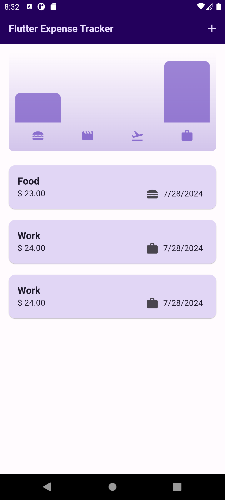
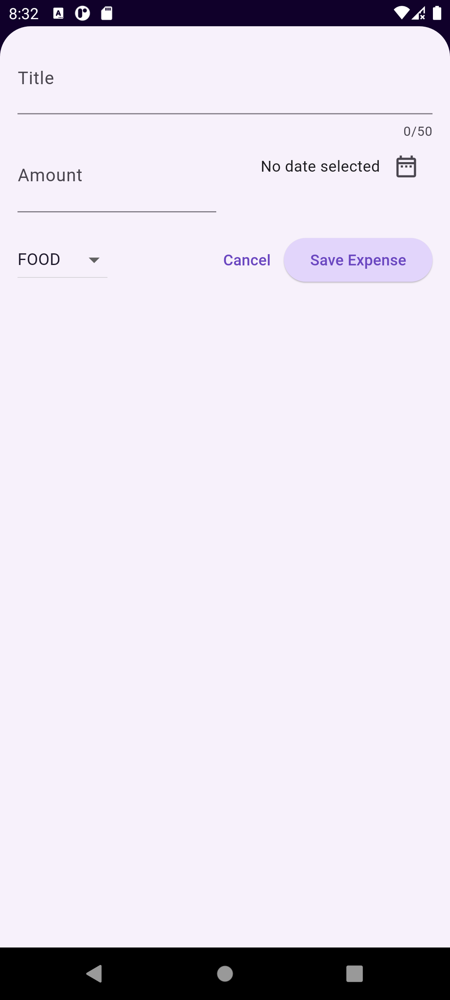

# Expense Tracker App

Welcome to the Expense Tracker App! This is my second app using Flutter, and it's been a great experience for me to discover a new field that I'm passionate about. This app helps users track their expenses and manage their finances efficiently.

## Features

- **Expense Tracking**: Easily add, edit, and delete expenses.
- **Expense Categories**: Categorize expenses for better organization.
- **Reports**: View detailed reports and charts of your spending habits.
- **Responsive Design**: Optimized for both mobile and tablet devices.

## Screenshots

<div style="display: flex; justify-content: space-evenly;">
    
    
</div>


## Getting Started

### Prerequisites

Make sure you have Flutter installed on your machine. You can follow the official [Flutter installation guide](https://flutter.dev/docs/get-started/install) for your operating system.

### Installation

1. Clone the repository:
    ```sh
    git clone https://github.com/RAFYA-Hamza/expense-tracker-app-flutter.git
    ```
2. Navigate to the project directory:
    ```sh
    cd quiz-app-flutter
    ```
3. Get the required dependencies:
    ```sh
    flutter pub get
    ```

### Running the App


